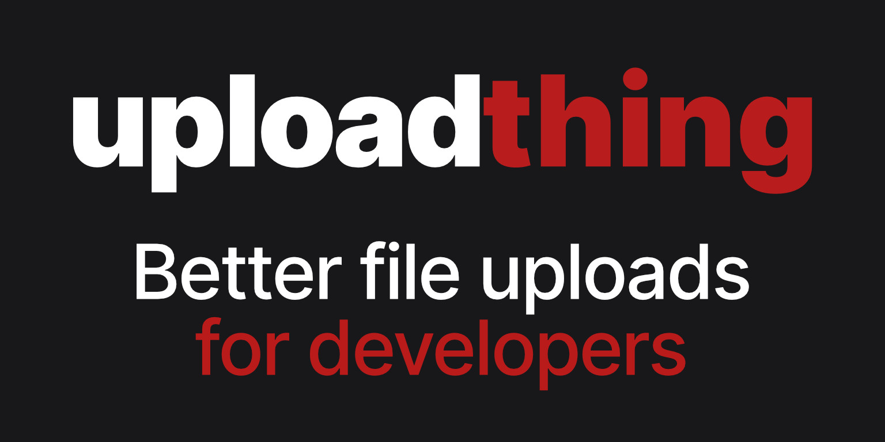

# ACM Webpage

This repository was made by the group ACM from Tecnológico de Monterrey - Querétaro. Includes the source code for the official web page of the group.

## Contents

- Home page: This page is the root of the web page with general information about the group and its social media.
- About us page: Information about the mision and vision that the group has in its community and the members of the group.
- Events page: Incoming events of the group planned displayed in a calendar.
- Projects page: The main projects the group is working on and has organized in its community.
- Resources page: Some resources that may be helpful for users visiting the page and want to learn more about computer science topics.
- Collaborators page: All the collaborators that the group has with a form for new users to register as collaborators. The collaborator of the month is displayed as well.
- Contact us page: A form where users can contact us through email and other social media.

#### - Admin dashboard:

- Private page for user with admin role to manage collaborators and future functions.

## Technologies

The web page was made with the [T3 Stack](https://create.t3.gg/), which includes technologies such as:

  

  

  

  

  

  

Additional technologies used:

  

  

  

## Credits

##### Edgar Martínez Retes

##### Santiago Alducín Villaseñor

##### Andrea Fátima Figueroa López

##### Romina Nájera Fuentes

##### Alejandra Arredondo

##### Luisa Fernanda Valdez Guillén

